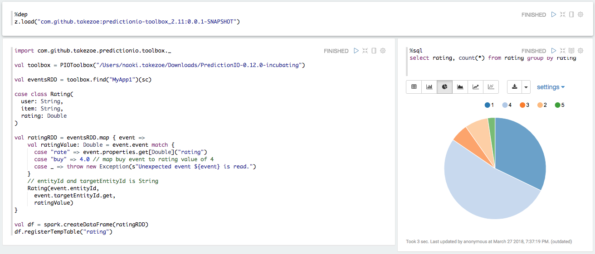

# Toolbox for Apache PredictionIO

predictionio-toolbox provides a simple way to access event data stored via the event server.

For example, you can use this library on Apache Zeppelin to see event data.

First, load the library as follows:

```scala
%dep
z.load("com.github.takezoe:predictionio-toolbox_2.11:0.0.1-SNAPSHOT")
```

Then you can process events and register them as tables which can be accessed from SparkSQL:

```scala
import com.github.takezoe.predictionio.toolbox._

// Create toolbox with PIO_HOME
val toolbox = PIOToolbox("/Users/naoki.takezoe/Downloads/PredictionIO-0.12.0-incubating")
val eventsRDD = toolbox.find("MyApp1")(sc)

case class Rating(
  user: String,
  item: String,
  rating: Double
)

val ratingRDD = eventsRDD.map { event => 
  val ratingValue: Double = event.event match {
    case "rate" => event.properties.get[Double]("rating")
    case "buy" => 4.0 // map buy event to rating value of 4
    case _ => throw new Exception(s"Unexpected event ${event} is read.")
  }
  // entityId and targetEntityId is String
  Rating(event.entityId,
    event.targetEntityId.get,
    ratingValue)
}

val df = spark.createDataFrame(ratingRDD)
df.registerTempTable("rating")
```

Now you can analyze event data using SQL:

```sql
%sql
select rating, count(*) from rating group by rating
```

